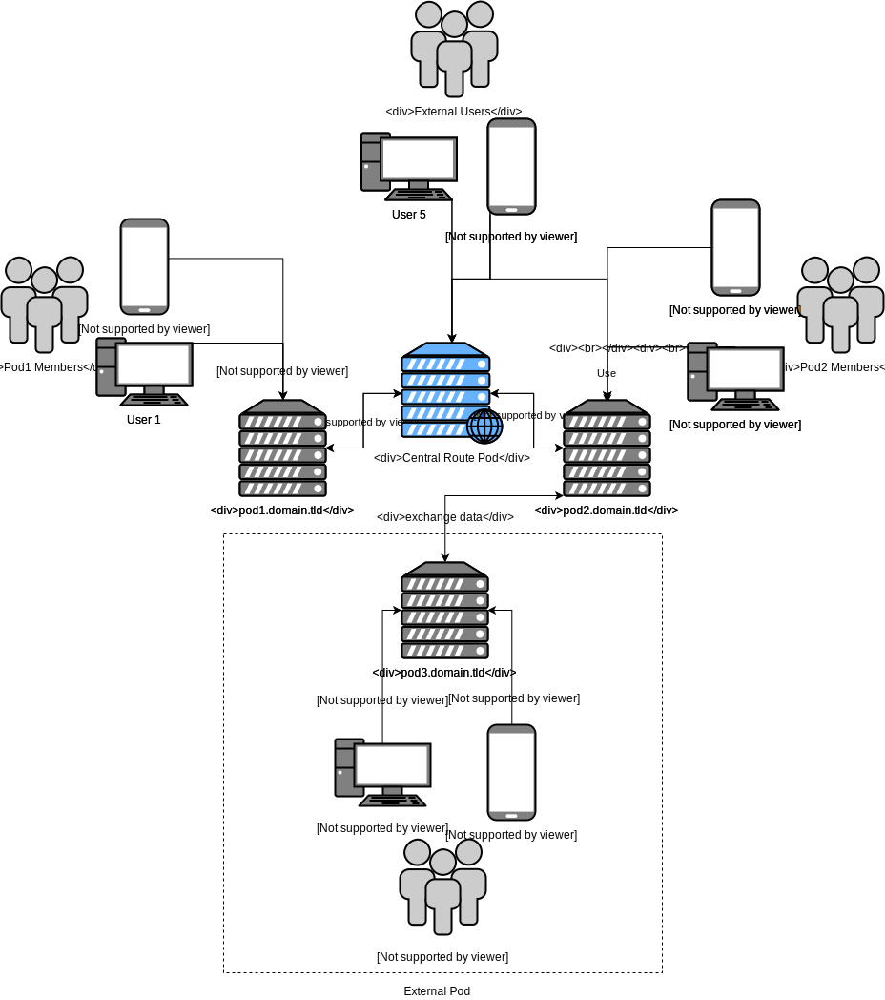

Find me on CCCAMP2019: 
- Current: already on my way back home :(

# share-your-stuff-api
This should be a open source api to allow small groups and individual share resources with each other.

## Key Functionality
The main concept of the API should allow a decentralized setup. The following are example scenarios of typical use cases:
1. You want to borrow your friends some unused tools or games, all the stuff that is only lying around 99% of the time.
2. You want to share cars with a certain group of people and track usage.
3. You want to rent/borrow your neighbors tools or other stuff.

### Unauthenticated features
- [ ] Offer object statics as open data, such as shares, objects registered, persons, CO2 reduced, etc.

### Authentication
- [ ] Login using password and email
- [ ] 2 Factor Login
- [ ] OAuth 2.0 as SSO to allow distributed access
- [ ] Allow use of other Login provider (Github, Google, etc.)

### User Information
- [ ] Change user details
- [ ] Set notification interval

### Object Management
- [ ] Add new object
- [ ] Delete object
- [ ] Update object details
- [ ] Configure visibility (e.g. closed, friends, friends+1)
- [ ] Remind the person who borrowed that you need the object (maybe earlier) to a specific data.
- [ ] (Optional): Add a price for the borrow/rental to cover for wearing off if the product is expensive (e.g. Car has insurance and tax costs in addtion to the wearing off per km)

#### Reminder
- [ ] Reminder (before leaving the house, at a specific time, etc) to take the object with you. (Co-worker whats to have a game, and you take it with you.)
- [ ] Reminder for the return of the borrowed objects
- [ ] Reminder to insert some more items

### Rental
- [ ] Search for objects in the your adjacent network
- [ ] View object
- [ ] Show availability/status of the object (rented out, next availability, is there a pre-booking)
- [ ] Rent/borrow an object
- [ ] Extend the time of use for the object
- [ ] Report a defect on the product.

#### Handover
The handover is a critical point, both parties should note prior defects on the object and acknowledge the handover. The following process could be an example:

__A__ wants to borrow object __O__ from __B__.
1. User meet for handover. (A&B)
2. Form with photos of object and text of usage state. (A)
3. Form generates a QR-Code, (A)
4. QR-Code is scanned and acknowledged. (B)
5. This is repeated after the object is returned.

The data generated can be used to have a tracking history of the people and defects over time.

### Wishlist
- [ ] Add an object to the wishlist. Users in adjacent network will get a notification if they have this object with the request to insert the object.

### Internal Chat
- [ ] Internal chat to discuss handover.

### Crawler for Product information
This should help users insert new objects into the application by providing crawled information:
- [ ] Search for EAN and other Product data to facilitate the item setup.
- [ ] Offer repair guides with the [iFixit API](https://www.ifixit.com/api/2.0/doc/)

### Misc
The following list is for ideas that can be discussed before implemented:
- Evaluate a user. (unsure)

# Competitive Products/Services
What is the state of the art at the moment? How well are they working? What can be learned from them?

## Commercial

- [__Weeshare:__](https://weeshare.com/app) Single platform with a lot of good features, but safes password in Local JavaScript. Registration doesn't work at the moment. (23.08.2019)
- [__peerby:__](https://www.peerby.com/one): Startup from the netherlands, with global target, can view objects near to my location only. No user verification. (23.08.2019)
- [__niriu:__](#url_unavailable): No longer available. (23.08.2019)
- [__WhyOwnIt:__](#url_unavailable): No longer available. (23.08.2019)

## Open Source
- [__leila:__](https://github.com/achimbo/leila/tree/master/leila): Undocumented open source implementation for a "__Le__ih __La__den". (23.08.2019)
- [__Commons Booking (Wordpress Plugin):__](https://github.com/wielebenwir/commons-booking): An open source wordpress plugin to administrate the rental of cargo bikes. (23.08.2019)

# Decentralized Setup

Each group should be able to setup their own pod (server with the api running) to have control about their data (see pod3).
A central instance (Central Route Pod) will be used to host an api instance for all users without technical knowledge and as a routing service for pods to find each other. E.g. Pod1 wants to find Pod2 to share stuff with each other.

# Ideas
All unsorted ideas below here:

## Additional APIs
- <strike>Amazon API https://amazon-affiliate.eu/de/zugriff-amazon-product-advertising-api/ (terms and conditions seem to prevent the use.)</strike>
- iFixit API https://www.ifixit.com/api/2.0/doc/
- https://opengtindb.org/api.php (Product Database for EAN)
- http://product-open-data.com (OKFN)
- https://barcode.fandom.com/wiki/Main_Page

# Contribute
Create an issue on github to contribute.
